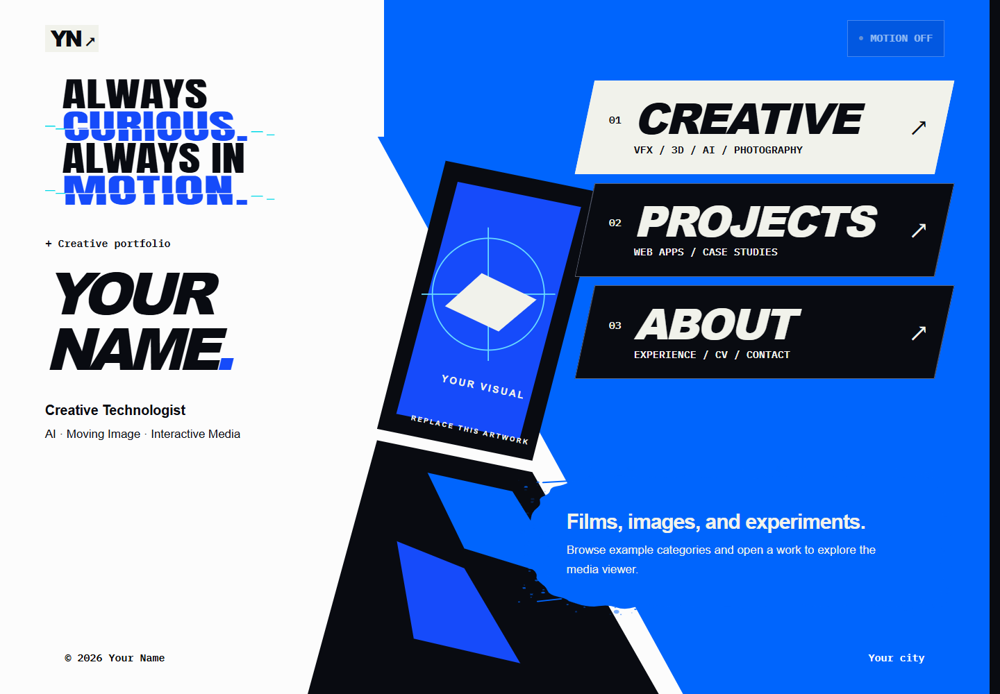

# Persona3-like-web

A reusable Persona-inspired portfolio with bold typography, animated chapter navigation, and editable example content.

[中文说明](README.zh-CN.md) · [Customization](docs/CUSTOMIZATION.md) · [Architecture](docs/ARCHITECTURE.md) · [MIT license](LICENSE)



## Included in 0.2

- Homepage parallax, magnetic navigation, animated manifesto, and section previews.
- Persistent ink cursor, clock/glass transitions, press feedback, and floating chapter navigation.
- Four Creative categories with dedicated routes, shareable work dialogs, optional video previews, and a photograph viewer with next/previous controls and scroll restoration.
- Local video and optional Mux playback. No playback IDs, API credentials, or personal videos are bundled.
- Project previews, an editable case study, a transition demo, and a working Three.js configurator with demonstration estimates.
- A profile page with education, experience, projects, skills, and recognition placeholders. Email and CV links remain hidden until configured.
- Local fonts, neutral SVG artwork and favicon, responsive layouts, and reduced-motion support.

Built with Next.js App Router, React, TypeScript, Tailwind CSS, Framer Motion, and Three.js. Heavy 3D and Mux playback code loads on demand.

## Run locally

Use Node.js 24 and npm (Node.js 22 or newer is supported).

```sh
npm ci
npm run dev
```

Open [localhost](http://127.0.0.1:3000). No environment variables are needed for the starter. To create an independent portfolio, use GitHub's **Use this template** action; to contribute changes, fork this repository.

## Customize

| File                           | Purpose                                                        |
| ------------------------------ | -------------------------------------------------------------- |
| `src/data/site.ts`             | Shared name, initials, title, location, metadata, hero artwork |
| `src/data/profile.ts`          | Biography, experience, education, optional email and CV        |
| `src/data/sections.ts`         | Homepage previews and chapter labels                           |
| `src/data/creativeProjects.ts` | Categories, media, photo series, optional playback IDs         |
| `src/data/works.ts`            | Project list and case study links                              |
| `src/app/(modules)/projects/`  | Example project pages                                          |
| `public/images/`               | Neutral placeholder artwork                                    |

See [customization instructions](docs/CUSTOMIZATION.md) for video setup and adding content.

## Verify

```sh
npm run check
npm run build
npx playwright install chromium
npm run test:e2e
```

The check command runs lint, TypeScript, formatting, the starter privacy guard, and unit tests. Browser tests use a production server on port 3100. GitHub Actions runs the same checks. On Linux use `npx playwright install --with-deps chromium`.

Other commands: `npm run format`, `npm run test:unit`, `npm run preview:alcove`, and optional `npm run check:mux`.

## Privacy and media

This starter contains generic text and original geometric placeholders. Personal portraits, resumes, photographs, films, screenshots of private projects, playback IDs, environment files, and local work archives are excluded. The source portfolio's Git history is not imported. Original public repository history and required license attribution remain intact.

The privacy guard is intended for contributions to this generic template. Update it deliberately in your personal fork when adding your own email and media. It is a regression check, not a substitute for inspecting assets and Git diffs.

## License and inspiration

Code and generic SVG artwork use the [MIT license](LICENSE). Bundled fonts retain their OFL notices in `src/app/fonts/`; dependency licenses remain their own.

An independent, unofficial project inspired by Persona's visual language. No official game artwork, music, logos, or fonts are included, and there is no affiliation with ATLUS or SEGA. Only add media you have permission to distribute.
